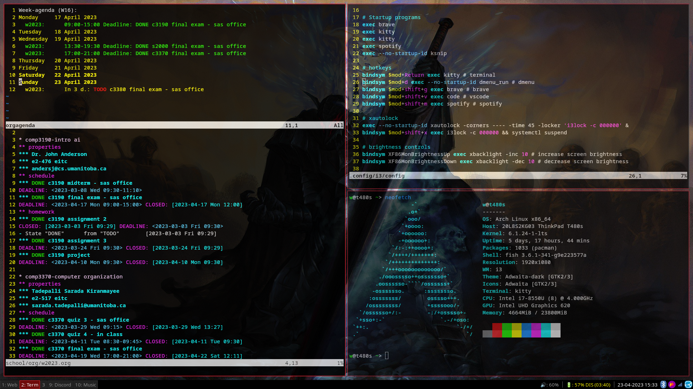
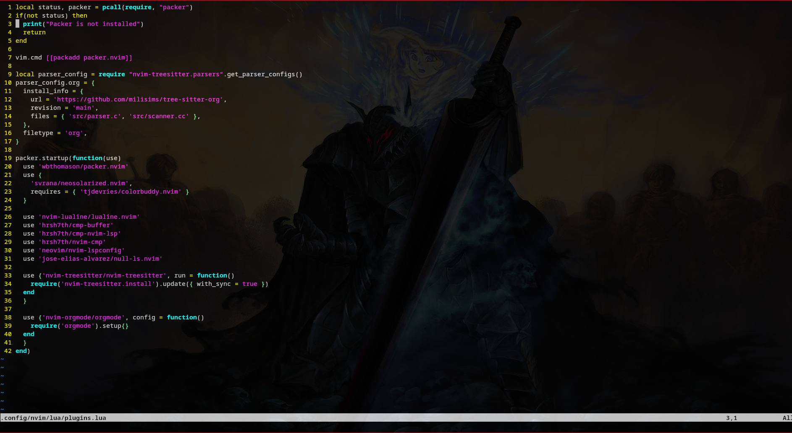

# winson's dotfiles

dotfiles for my arch linux setup

- [winson's dotfiles](#winsons-dotfiles)
  - [i3 config](#i3-config)
  - [neovim config + dependencies](#neovim-config--dependencies)
  - [xorg config](#xorg-config)
  - [picom config](#picom-config)
  - [lightdm config](#lightdm-config)

## i3 config

environment programs:

- [yay](https://github.com/Jguer/yay)
- dmenu-git
- xautolock
- xorg-server
- picom
- feh
- networkmanager
- bluetooth / blueman
- pulseaudio
- [lightdm](https://archlinux.org/packages/?name=lightdm)
  - lightdm-gtk-greeter
- neofetch
- thunar
- syncthing
- syncthingtray
- noto-fonts
- ttf-font-awesome
- fish

required programs:

- firefox
- kitty
- [discord](https://aur.archlinux.org/packages/discord_arch_electron)
- [vscode](https://aur.archlinux.org/packages/visual-studio-code-bin)
- okular
- [spotify](https://aur.archlinux.org/packages/spotify)
- flameshot

## neovim config + dependencies

neovim mostly just for small edits and orgmode

- [nvim-treesitter](https://github.com/nvim-treesitter/nvim-treesitter)
- [packer.nvim](https://github.com/wbthomason/packer.nvim)
  - [cmp-buffer](https://github.com/hrsh7th/cmp-buffer)
  - [cmp-nvim-lsp](https://github.com/hrsh7th/cmp-nvim-lsp)
  - [colorbuddy.nvim](https://github.com/tjdevries/colorbuddy.nvim)
  - [gruvbox.nvim](https://github.com/ellisonleao/gruvbox.nvim)
  - [lualine.nvim](https://github.com/nvim-lualine/lualine.nvim)
  - [neosolarized.nvim](https://github.com/svrana/neosolarized.nvim)
  - [null-ls.nvim](https://github.com/jose-elias-alvarez/null-ls.nvim)
  - [nvim-cmp](https://github.com/hrsh7th/nvim-cmp)
  - [nvim-lspconfig](https://github.com/neovim/nvim-lspconfig)
  - [orgmode](https://github.com/nvim-orgmode/orgmode)

## xorg config

located in `/etc/X11/xorg.conf.d/`

- changed touchpad scroll direction
- changed trackpoint scroll direction
- disabled acceleration
- adjusted sensitivity

## picom config

- setting kitty opacity

## lightdm config

located in `/etc/lightdm/`

- changing background to `lock.jpeg`
